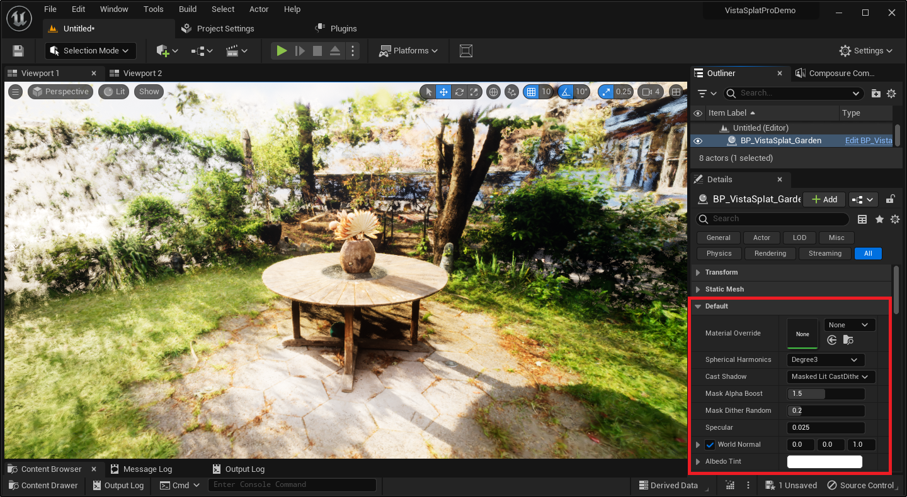

# 使い方

## インポート

{ loading=lazy }  

1. UEエディタ上部のメニューで「Window > Import 3D Gaussians」を選択します
2. ダイアログ画面で、3D Gaussian Splattingの学習結果の「point_cloud.ply」を選択します。

!!! Failure "パスは英数字のみ"
	日本語などマルチバイト文字が含まれるパスからはインポートできません。  
	パスには英数字のみが含まれるようにしてください。

## レベルへの配置

{ loading=lazy }  

コンテンツブラウザで「Content > VistaSplatPro > モデル名」の下の「BP_VistaSplatPro_モデル名」をレベル上にドラッグ＆ドロップします。

## クロップ範囲の変更

{ loading=lazy }  

1. レベルに配置した「BP_VistaSplatPro_モデル名」を選択します。
2. 詳細パネルのコンポーネントツリーで「Crop Volume」コンポーネントを選択します。
3. ビューポートまたは詳細パネルで、コンポーネントの位置、向き、サイズを変更します。

## 描画の調整

{ loading=lazy }  

- **Material Override**: 独自に修正したマテリアルを使用する場合はここにセットします。
- **Spherical Harmonics**: 色の描画方法を選択します。  
	- 「Degree 0」は見る角度による色の変化を無効にします（反射などがなくなります）。
	- 「Degree 3」は見る角度による色の変化を有効にします。
- **Cast Shadow**: 影の描画方法を選択します。  
	- 「Masked Unlit NoShadow」にすると、このモデルから影を落とさず、また、影やライトを受けなくなりす。
	- 「Masked Lit DoNotCastShadow」にすると、このモデルから影を落とさなくなります。
	- 「Masked Lit CastShadow」にすると、このモデルから影を落とすようになります。
	- 「Masked Lit CastDetheredShadow」にすると、ディザを使用したより高品質な影を落とすようになります。  
	- 「Translucent Unlit NoShadow」にすると、影を落とさず、影を受けず、ライトも受けない半透明マテリアルとして描画します。元来の3D Gaussian Splattingの描画に最も近い描画方式です。  

		!!! Warning "Translucent は TSR、TAA、Motion Blur 不可"
			Anti-aliasing方法がTemporal Super Resolution (TSR)またはTemporal Anti-Aliasing (TAA)であったり、Motion Blurが有効である場合、「Translucent Unlit NoShadow」にすると残像が顕著に表れます。  
			TSRやTAAやMotion Blurを使用する場合は、「Masked」のいずれかに設定してください。

- **Mask Alpha Boost**: 個々のガウス分布を描画するマスクの透明度を調整します。主に、光や影を受ける範囲の調整に使用します。
- **Mask Dither Random**: 個々のガウス分布を描画するマスクのノイズ強度を調整します。主に、光や影を受ける範囲の調整に使用します。
- **Specular**: このモデル全体で使用するスぺキュラの値を指定します。
- **World Normal**: このモデル全体で使用する世界座標系での法線の値を指定します。